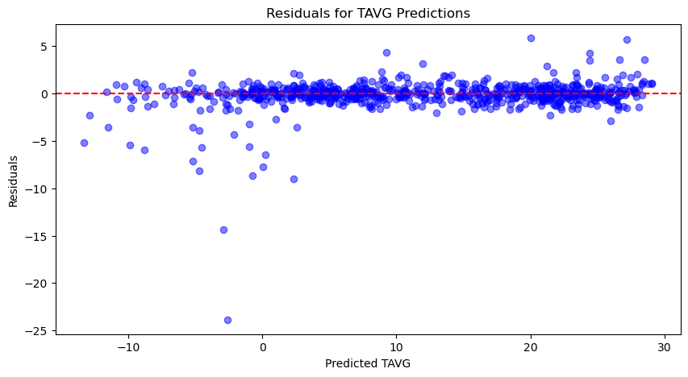
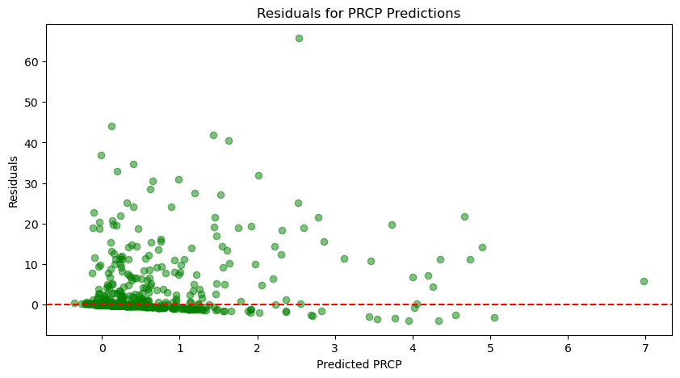

## SVM


```python
import pandas as pd
from sklearn.model_selection import train_test_split
from sklearn.preprocessing import StandardScaler
from sklearn.svm import SVR
from sklearn.metrics import mean_squared_error, mean_absolute_error, r2_score
import matplotlib.pyplot as plt

# Load datasets
data = pd.read_csv('/Users/zachetzkorn/Downloads/export.csv')
lastMonth = pd.read_csv('/Users/zachetzkorn/Downloads/lastMonth.csv')

# Remove unnecessary columns
data.drop(columns=['wpgt', 'tsun', 'date'], inplace=True)
lastMonth.drop(columns=['wpgt', 'tsun'], inplace=True)

# Fill missing values with forward fill
data.fillna(method='ffill', inplace=True)
lastMonth.fillna(method='ffill', inplace=True)

# Save cleaned datasets
data.to_csv('cleaned_export.csv', index=False)
lastMonth.to_csv('cleaned_month.csv', index=False)

# Define features (X) and targets (y)
X = data.drop(columns=['tavg', 'prcp'])
y_tavg = data['tavg']  # Target: temperature
y_prcp = data['prcp']  # Target: precipitation
```


```python
# Split data for 'tavg' prediction
X_train_tavg, X_test_tavg, y_train_tavg, y_test_tavg = train_test_split(X, y_tavg, test_size=0.2, random_state=42)

# Split data for 'prcp' prediction
X_train_prcp, X_test_prcp, y_train_prcp, y_test_prcp = train_test_split(X, y_prcp, test_size=0.2, random_state=42)
```

SVMs assume that the data it works with is in a standard range, like 0 to 1 so we must standardize the data before feeding it to the SVM. 


```python
# Initialize scalers
scaler_tavg = StandardScaler()
scaler_prcp = StandardScaler()

# Scale training and testing data for 'tavg'
X_train_tavg_scaled = scaler_tavg.fit_transform(X_train_tavg)
X_test_tavg_scaled = scaler_tavg.transform(X_test_tavg)

# Scale training and testing data for 'prcp'
X_train_prcp_scaled = scaler_prcp.fit_transform(X_train_prcp)
X_test_prcp_scaled = scaler_prcp.transform(X_test_prcp)
```


```python
# Create SVM models for 'tavg' and 'prcp'
svr_tavg = SVR(kernel='rbf') 
svr_prcp = SVR(kernel='rbf')

# Train the SVM model for 'tavg'
svr_tavg.fit(X_train_tavg_scaled, y_train_tavg)

# Train the SVM model for 'prcp'
svr_prcp.fit(X_train_prcp_scaled, y_train_prcp)
```


<style>#sk-container-id-6 {color: black;}#sk-container-id-6 pre{padding: 0;}#sk-container-id-6 div.sk-toggleable {background-color: white;}#sk-container-id-6 label.sk-toggleable__label {cursor: pointer;display: block;width: 100%;margin-bottom: 0;padding: 0.3em;box-sizing: border-box;text-align: center;}#sk-container-id-6 label.sk-toggleable__label-arrow:before {content: "▸";float: left;margin-right: 0.25em;color: #696969;}#sk-container-id-6 label.sk-toggleable__label-arrow:hover:before {color: black;}#sk-container-id-6 div.sk-estimator:hover label.sk-toggleable__label-arrow:before {color: black;}#sk-container-id-6 div.sk-toggleable__content {max-height: 0;max-width: 0;overflow: hidden;text-align: left;background-color: #f0f8ff;}#sk-container-id-6 div.sk-toggleable__content pre {margin: 0.2em;color: black;border-radius: 0.25em;background-color: #f0f8ff;}#sk-container-id-6 input.sk-toggleable__control:checked~div.sk-toggleable__content {max-height: 200px;max-width: 100%;overflow: auto;}#sk-container-id-6 input.sk-toggleable__control:checked~label.sk-toggleable__label-arrow:before {content: "▾";}#sk-container-id-6 div.sk-estimator input.sk-toggleable__control:checked~label.sk-toggleable__label {background-color: #d4ebff;}#sk-container-id-6 div.sk-label input.sk-toggleable__control:checked~label.sk-toggleable__label {background-color: #d4ebff;}#sk-container-id-6 input.sk-hidden--visually {border: 0;clip: rect(1px 1px 1px 1px);clip: rect(1px, 1px, 1px, 1px);height: 1px;margin: -1px;overflow: hidden;padding: 0;position: absolute;width: 1px;}#sk-container-id-6 div.sk-estimator {font-family: monospace;background-color: #f0f8ff;border: 1px dotted black;border-radius: 0.25em;box-sizing: border-box;margin-bottom: 0.5em;}#sk-container-id-6 div.sk-estimator:hover {background-color: #d4ebff;}#sk-container-id-6 div.sk-parallel-item::after {content: "";width: 100%;border-bottom: 1px solid gray;flex-grow: 1;}#sk-container-id-6 div.sk-label:hover label.sk-toggleable__label {background-color: #d4ebff;}#sk-container-id-6 div.sk-serial::before {content: "";position: absolute;border-left: 1px solid gray;box-sizing: border-box;top: 0;bottom: 0;left: 50%;z-index: 0;}#sk-container-id-6 div.sk-serial {display: flex;flex-direction: column;align-items: center;background-color: white;padding-right: 0.2em;padding-left: 0.2em;position: relative;}#sk-container-id-6 div.sk-item {position: relative;z-index: 1;}#sk-container-id-6 div.sk-parallel {display: flex;align-items: stretch;justify-content: center;background-color: white;position: relative;}#sk-container-id-6 div.sk-item::before, #sk-container-id-6 div.sk-parallel-item::before {content: "";position: absolute;border-left: 1px solid gray;box-sizing: border-box;top: 0;bottom: 0;left: 50%;z-index: -1;}#sk-container-id-6 div.sk-parallel-item {display: flex;flex-direction: column;z-index: 1;position: relative;background-color: white;}#sk-container-id-6 div.sk-parallel-item:first-child::after {align-self: flex-end;width: 50%;}#sk-container-id-6 div.sk-parallel-item:last-child::after {align-self: flex-start;width: 50%;}#sk-container-id-6 div.sk-parallel-item:only-child::after {width: 0;}#sk-container-id-6 div.sk-dashed-wrapped {border: 1px dashed gray;margin: 0 0.4em 0.5em 0.4em;box-sizing: border-box;padding-bottom: 0.4em;background-color: white;}#sk-container-id-6 div.sk-label label {font-family: monospace;font-weight: bold;display: inline-block;line-height: 1.2em;}#sk-container-id-6 div.sk-label-container {text-align: center;}#sk-container-id-6 div.sk-container {/* jupyter's `normalize.less` sets `[hidden] { display: none; }` but bootstrap.min.css set `[hidden] { display: none !important; }` so we also need the `!important` here to be able to override the default hidden behavior on the sphinx rendered scikit-learn.org. See: https://github.com/scikit-learn/scikit-learn/issues/21755 */display: inline-block !important;position: relative;}#sk-container-id-6 div.sk-text-repr-fallback {display: none;}</style><div id="sk-container-id-6" class="sk-top-container"><div class="sk-text-repr-fallback"><pre>SVR()</pre><b>In a Jupyter environment, please rerun this cell to show the HTML representation or trust the notebook. <br />On GitHub, the HTML representation is unable to render, please try loading this page with nbviewer.org.</b></div><div class="sk-container" hidden><div class="sk-item"><div class="sk-estimator sk-toggleable"><input class="sk-toggleable__control sk-hidden--visually" id="sk-estimator-id-6" type="checkbox" checked><label for="sk-estimator-id-6" class="sk-toggleable__label sk-toggleable__label-arrow">SVR</label><div class="sk-toggleable__content"><pre>SVR()</pre></div></div></div></div></div>


## Numerical Metrics


```python
# Metrics for 'tavg'
tavg_rmse = mean_squared_error(y_test_tavg, y_pred_tavg, squared=False)
tavg_mae = mean_absolute_error(y_test_tavg, y_pred_tavg)
tavg_r2 = r2_score(y_test_tavg, y_pred_tavg)

print("TAVG Metrics:")
print(f"RMSE: {tavg_rmse}")
print(f"MAE: {tavg_mae}")
print(f"R^2: {tavg_r2}")

# Metrics for 'prcp'
prcp_rmse = mean_squared_error(y_test_prcp, y_pred_prcp, squared=False)
prcp_mae = mean_absolute_error(y_test_prcp, y_pred_prcp)
prcp_r2 = r2_score(y_test_prcp, y_pred_prcp)

print("\nPRCP Metrics:")
print(f"RMSE: {prcp_rmse}")
print(f"MAE: {prcp_mae}")
print(f"R^2: {prcp_r2}")
```

    TAVG Metrics:
    RMSE: 1.6486068526044289
    MAE: 0.7906571832366532
    R^2: 0.9764082401408671
    
    PRCP Metrics:
    RMSE: 7.202636129162471
    MAE: 2.8321560619515083
    R^2: -0.046661898870858476


## Model Performance Visualizations 


```python
# Predict on test data for 'tavg' and 'prcp'
y_pred_tavg = svr_tavg.predict(X_test_tavg_scaled)
y_pred_prcp = svr_prcp.predict(X_test_prcp_scaled)

# Plot Predicted vs Actual for 'tavg'
plt.figure(figsize=(10, 5))
plt.scatter(y_test_tavg, y_pred_tavg, alpha=0.5, color='blue', label='tavg Predictions')
plt.plot([min(y_test_tavg), max(y_test_tavg)], [min(y_test_tavg), max(y_test_tavg)], color='red', linestyle='--')
plt.xlabel("Actual TAVG")
plt.ylabel("Predicted TAVG")
plt.title("Predicted vs Actual TAVG")
plt.legend()
plt.show()

# Plot Predicted vs Actual for 'prcp'
plt.figure(figsize=(10, 5))
plt.scatter(y_test_prcp, y_pred_prcp, alpha=0.5, color='green', label='prcp Predictions')
plt.plot([min(y_test_prcp), max(y_test_prcp)], [min(y_test_prcp), max(y_test_prcp)], color='red', linestyle='--')
plt.xlabel("Actual PRCP")
plt.ylabel("Predicted PRCP")
plt.title("Predicted vs Actual PRCP")
plt.legend()
plt.show()
```


    

    


    

    


```python
# Residual plot for 'tavg'
residuals_tavg = y_test_tavg - y_pred_tavg
plt.figure(figsize=(10, 5))
plt.scatter(y_pred_tavg, residuals_tavg, alpha=0.5, color='blue')
plt.axhline(y=0, color='red', linestyle='--')
plt.xlabel("Predicted TAVG")
plt.ylabel("Residuals")
plt.title("Residuals for TAVG Predictions")
plt.show()

# Residual plot for 'prcp'
residuals_prcp = y_test_prcp - y_pred_prcp
plt.figure(figsize=(10, 5))
plt.scatter(y_pred_prcp, residuals_prcp, alpha=0.5, color='green')
plt.axhline(y=0, color='red', linestyle='--')
plt.xlabel("Predicted PRCP")
plt.ylabel("Residuals")
plt.title("Residuals for PRCP Predictions")
plt.show()
```


    

    


    

    

