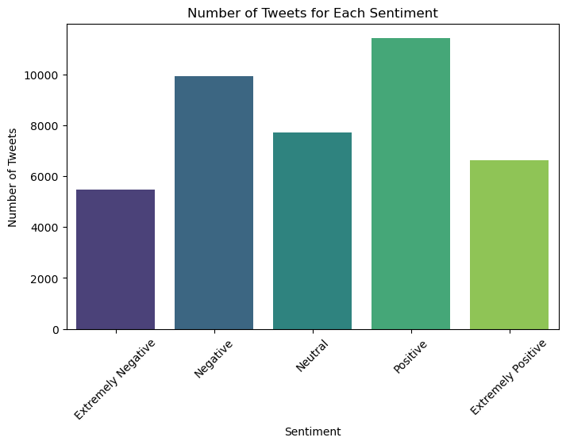
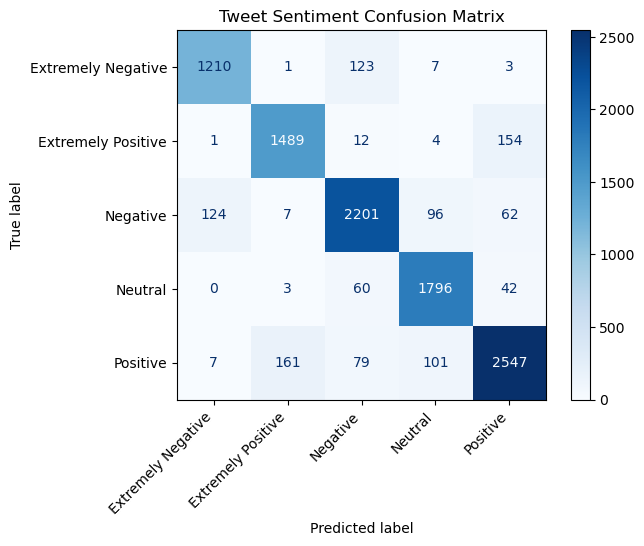

## Sentiment Analysis of Tweets during COVID-19

This dataset is borrowed from [kaggle](https://www.kaggle.com/datasets/datatattle/covid-19-nlp-text-classification). 
<br><br>  
The tweets have been pulled from Twitter and manual tagging has been done to them.
<br><br>
The relevant features are:
<br><br>
&nbsp;&nbsp;&nbsp;&nbsp;    Location: (Location where tweet was made)
<br><br>
&nbsp;&nbsp;&nbsp;&nbsp;    TweetAt: (Date on which tweet was made)
<br><br>
&nbsp;&nbsp;&nbsp;&nbsp;    OriginalTweet: (The text data of the tweet)
<br><br>
&nbsp;&nbsp;&nbsp;&nbsp;    Sentiment: (The manually tagged sentiment)
<br><br>
This project will explore methods of sentiment analysis using Naive Bayes and Support Vector Machines. Two methods of text vectorization will be trialed and compared for performance with each estimator. These are: TF-IDF(Term Frequency-Inverse Document Frequency) & GloVe.
<br><br>
<b>TF-IDF (Term Frequency-Inverse Document Frequency):</b>
<br><br>
For each tweet, Term Frequency (TF) measures how often a word appears in that tweet. If a word appears frequently in a particular tweet, its TF score will be higher for that tweet.
<br><br>
Inverse Document Frequency (IDF) measures how common or rare a word is across all tweets. If a word appears in many tweets, its IDF score will be lower. This helps to reduce the weight of common words (like "the," "is," etc.) that do not carry much information.
<br><br>
This means that words that are common in a specific tweet but rare across the entire dataset will have a high TF-IDF score, making them important for understanding the content of that tweet.
<br><br>
In the context of this dataset, if the word "COVID-19" appears frequently in a tweet but is rare in the overall dataset, it will receive a high TF-IDF score, indicating its significance to that tweet's sentiment.
<br><br>
<b>GloVe</b>
<br><br>
GloVe is designed to capture the semantic relationships between words based on their context within a text corpus. It transforms words into vectors that represent their meanings and relationships to other words.
<br><br>
By representing words in a way that captures their meanings and relationships, GloVe allows models to understand context better, which is crucial for tasks like sentiment analysis.
<br><br>
<b>Project Objective</b>
<br><br>
The objective of this project is to find the most accurate way to predict the sentiment of a tweet during covid. This is a multi-class classification with the tweet as input and the classes (Extremely Negative, Negative, Neutral, Positive, and Extremely Positive) as output.  By comparing performance between model and text vectorization combinations, the optimal model and text vectorization method will be found and deployed.  

## Visualizing The Dataset
First, let's import all necessary packages for this project.  


```python
import numpy as np
import pandas as pd
import matplotlib.pyplot as plt
import seaborn as sns
from sklearn.metrics import accuracy_score, classification_report, confusion_matrix, ConfusionMatrixDisplay
from sklearn.model_selection import train_test_split, cross_val_score, GridSearchCV
from sklearn.naive_bayes import GaussianNB
from sklearn.preprocessing import StandardScaler
from sklearn.feature_extraction.text import TfidfVectorizer
from sklearn import svm
from sklearn.svm import SVC
from sklearn.pipeline import make_pipeline
from sklearn import metrics
from scipy.sparse import hstack
from nltk.sentiment import SentimentIntensityAnalyzer
from nltk.corpus import stopwords
from nltk.stem import WordNetLemmatizer
import nltk

# Importing the dataset
dataset = pd.read_csv('Corona_NLP_train.csv', encoding='latin-1')

# Split the data into inputs and outputs
X = dataset.iloc[:, 4].values  # tweet
y = dataset.iloc[:, 5].values  # sentiment 
```

Next, we can make a bar chart to show the number of tweets with each sentiment. 


```python
# Count the number of tweets for each sentiment
sentiment_counts = dataset['Sentiment'].value_counts().reset_index()
sentiment_counts.columns = ['Sentiment', 'Tweet Count']

# Define the order of sentiments
sentiment_order = ['Extremely Negative', 'Negative', 'Neutral', 'Positive', 'Extremely Positive']

# Create a bar chart with ordered sentiments
plt.figure(figsize=(8, 5))
sns.barplot(x='Sentiment', y='Tweet Count', data=sentiment_counts, palette='viridis', order=sentiment_order)
plt.title('Number of Tweets for Each Sentiment')
plt.xlabel('Sentiment')
plt.ylabel('Number of Tweets')
plt.xticks(rotation=45)
plt.show()
```


    

    


## Naive Bayes with GloVe


```python
# Function to load GloVe vectors
def load_glove_vectors(file_path):
    glove_vectors = {}
    with open(file_path, 'r', encoding='utf-8') as f:
        for line in f:
            values = line.split()
            word = values[0]
            vector = np.array(values[1:], dtype='float32')
            glove_vectors[word] = vector
    return glove_vectors

# Load GloVe vectors (update the path to your downloaded file)
glove_vectors = load_glove_vectors('/Users/zachetzkorn/Downloads/glove/glove.6B.100d.txt')

# Training and testing data; assign test data size 25%
X_train, X_test, y_train, y_test = train_test_split(X, y, test_size=0.25, random_state=0)

# Preprocessing the text data for GloVe
def preprocess_text(text):
    return text.lower().split()  # Simple tokenization and lowering case

# Tokenizing the tweets
X_train_tokens = [preprocess_text(tweet) for tweet in X_train]
X_test_tokens = [preprocess_text(tweet) for tweet in X_test]

# Create a function to convert sentences to vectors using GloVe
def vectorize_sentences(tokens, glove_vectors):
    vector = np.zeros(100)  # Change to the dimension of your GloVe vectors
    count = 0
    for word in tokens:
        if word in glove_vectors:
            vector += glove_vectors[word]
            count += 1
    return vector / count if count > 0 else vector

# Vectorizing the training and testing data
X_train_vectors = np.array([vectorize_sentences(tokens, glove_vectors) for tokens in X_train_tokens])
X_test_vectors = np.array([vectorize_sentences(tokens, glove_vectors) for tokens in X_test_tokens])

# Scaling the input data
sc_X = StandardScaler()
X_train_scaled = sc_X.fit_transform(X_train_vectors)
X_test_scaled = sc_X.transform(X_test_vectors)

# Initialise Naive Bayes classifier
clsf = GaussianNB()

# Train the model on the training set
clsf.fit(X_train_scaled, y_train)

# Test the model on the test set
y_pred = clsf.predict(X_test_scaled)

# Model performance on the test set
print(classification_report(y_test, y_pred))
```

                        precision    recall  f1-score   support
    
    Extremely Negative       0.27      0.35      0.30      1344
    Extremely Positive       0.26      0.68      0.37      1660
              Negative       0.31      0.14      0.20      2490
               Neutral       0.38      0.41      0.40      1901
              Positive       0.35      0.11      0.17      2895
    
              accuracy                           0.30     10290
             macro avg       0.31      0.34      0.29     10290
          weighted avg       0.32      0.30      0.27     10290
    


## Naive Bayes with TF-IDF


```python
# Preprocessing the text data
tfidf_vectorizer = TfidfVectorizer(max_features=1000)  # Adjust max_features as needed
X_train_tfidf = tfidf_vectorizer.fit_transform(X_train)
X_test_tfidf = tfidf_vectorizer.transform(X_test)

# Convert TF-IDF transformed data to dense arrays
X_train_dense = X_train_tfidf.toarray()
X_test_dense = X_test_tfidf.toarray()

# scalling the input data
sc_X = StandardScaler(with_mean=False)  # Set with_mean=False since TF-IDF output is sparse
X_train_scaled = sc_X.fit_transform(X_train_dense)
X_test_scaled = sc_X.transform(X_test_dense)

# initialise NB
clsf = GaussianNB()

# train model
clsf.fit(X_train_scaled, y_train)

# testing the model
y_pred = clsf.predict(X_test_scaled)

# model performance
print(classification_report(y_test, y_pred))
```

                        precision    recall  f1-score   support
    
    Extremely Negative       0.35      0.57      0.43      1344
    Extremely Positive       0.40      0.66      0.49      1660
              Negative       0.43      0.18      0.25      2490
               Neutral       0.43      0.74      0.54      1901
              Positive       0.46      0.17      0.24      2895
    
              accuracy                           0.41     10290
             macro avg       0.41      0.46      0.39     10290
          weighted avg       0.42      0.41      0.37     10290
    


## Comparison of GloVe and TF-IDF for Naive Bayes

We see GloVe delivers an accuracy score of 0.3 and TF-IDF delivers an accuracy of 0.41, making TF-IDF more suited for Naive Bayes. Since TF-IDF has a higher accuracy, we can try and tune the hyperparameters to improve accuracy. 

## Naive Bayes (Hyperparameter tuning: var_smoothing)
We will find the optimal hyperparamter for var_smoothing by evaluating the accuracy of the model with different var_smoothing amounts ranging from 1e-10 to 1. The result will be printed as the most accurate var_smoothing value among these values and the accuracy score with that value as the hyperparameter. 


```python
var_smoothing_values = np.logspace(-10, 0, 10)  # 10 values from 1e-10 to 1

best_score = 0
best_var_smoothing = None

# Evaluate each var_smoothing value
for var_smoothing in var_smoothing_values:
    clsf = GaussianNB(var_smoothing=var_smoothing)
    cv_scores = cross_val_score(clsf, X_train_scaled, y_train, cv=5, scoring='accuracy')  # Using 5-fold cross-validation
    mean_score = np.mean(cv_scores)

    # Check if this is the best score
    if mean_score > best_score:
        best_score = mean_score
        best_var_smoothing = var_smoothing

print(f'Best var_smoothing: {best_var_smoothing} with Mean CV Score: {best_score}')
```

    Best var_smoothing: 0.005994842503189421 with Mean CV Score: 0.4012695127652629


## Naive Bayes (Hyperparameter variation: prior)

For this hyperparameter, we will find the actual proportion of each output feature in our data to use as the prior hyperparameter. 


```python
# Calculate sentiment proportions for priors
sentiment_counts = dataset['Sentiment'].value_counts(normalize=True)
priors = sentiment_counts.sort_index().values  # Ensure correct order of classes
```

Now that we have optimal hyperparameters, let's apply both of them to our model and see how its performance changes. 


```python
# Train the model with the best var_smoothing and the calculated priors
clsf = GaussianNB(var_smoothing=best_var_smoothing, priors=priors)
clsf.fit(X_train_scaled, y_train)

# Test the model
y_pred = clsf.predict(X_test_scaled)

# Model performance
print(classification_report(y_test, y_pred))
```

                        precision    recall  f1-score   support
    
    Extremely Negative       0.35      0.56      0.43      1344
    Extremely Positive       0.39      0.64      0.49      1660
              Negative       0.42      0.20      0.27      2490
               Neutral       0.45      0.71      0.55      1901
              Positive       0.46      0.19      0.27      2895
    
              accuracy                           0.41     10290
             macro avg       0.41      0.46      0.40     10290
          weighted avg       0.42      0.41      0.38     10290
    


As we can see, the accuracy remains the same with optimal hyperparameters. Let's try SVM.<br><br> We will try SVM's with text vectorization methods, GloVe and TF-IDF. In each text vectorization method, we will compare linear to radial based function kernels and compare performance.

## Support Vector Machine With GloVe


```python
# Load the new dataset
new_dataset = pd.read_csv('Corona_NLP_test.csv', encoding='latin-1')

# Split the data into inputs and outputs
X_new = new_dataset.iloc[:, 4].values  # tweet column is at index 4
y_new = new_dataset.iloc[:, 5].values  # sentiment column is at index 5

# Preprocessing the text data for GloVe
X_new_tokens = [preprocess_text(tweet) for tweet in X_new]

# Vectorizing the new data using GloVe
X_new_vectors = np.array([vectorize_sentences(tokens, glove_vectors) for tokens in X_new_tokens])

# Initialize and train the SVM model on the new dataset
clf = svm.SVC(kernel='linear')  
clf.fit(X_new_vectors, y_new)  

# Predict on the new dataset
y_new_pred = clf.predict(X_new_vectors)

# Print classification report for the new dataset
print(classification_report(y_new, y_new_pred))
```

                        precision    recall  f1-score   support
    
    Extremely Negative       0.55      0.25      0.35       592
    Extremely Positive       0.55      0.40      0.46       599
              Negative       0.41      0.65      0.51      1041
               Neutral       0.57      0.35      0.44       619
              Positive       0.39      0.44      0.41       947
    
              accuracy                           0.45      3798
             macro avg       0.50      0.42      0.43      3798
          weighted avg       0.48      0.45      0.44      3798
    


```python
clf = svm.SVC(kernel='rbf')  # Change the kernal to 'rbf'
clf.fit(X_new_vectors, y_new)  


y_new_pred = clf.predict(X_new_vectors)


print(classification_report(y_new, y_new_pred))
```

                        precision    recall  f1-score   support
    
    Extremely Negative       1.00      0.00      0.00       592
    Extremely Positive       0.58      0.04      0.08       599
              Negative       0.36      0.77      0.49      1041
               Neutral       0.66      0.28      0.40       619
              Positive       0.36      0.48      0.41       947
    
              accuracy                           0.38      3798
             macro avg       0.59      0.31      0.28      3798
          weighted avg       0.54      0.38      0.31      3798
    


## Support Vector Machine With TF-IDF


```python
vectorizer = TfidfVectorizer(max_features=2000, stop_words='english')
X_train_tfidf = vectorizer.fit_transform(X_train)
X_test_tfidf = vectorizer.transform(X_test)

clf = svm.SVC(kernel='linear')
clf.fit(X_train_tfidf, y_train)

# Predict on the test set
y_pred = clf.predict(X_test_tfidf)

# Print classification report
print(classification_report(y_test, y_pred))
```

                        precision    recall  f1-score   support
    
    Extremely Negative       0.62      0.52      0.57      1344
    Extremely Positive       0.70      0.56      0.62      1660
              Negative       0.54      0.53      0.53      2490
               Neutral       0.62      0.75      0.68      1901
              Positive       0.57      0.62      0.60      2895
    
              accuracy                           0.60     10290
             macro avg       0.61      0.60      0.60     10290
          weighted avg       0.60      0.60      0.60     10290
    


```python
# Initialize and train the SVM model with RBF kernel 
clf = svm.SVC(kernel='rbf')
clf.fit(X_train_tfidf, y_train)
y_pred = clf.predict(X_test_tfidf)
print(classification_report(y_test, y_pred))
```

                        precision    recall  f1-score   support
    
    Extremely Negative       0.69      0.48      0.56      1344
    Extremely Positive       0.73      0.51      0.60      1660
              Negative       0.53      0.56      0.55      2490
               Neutral       0.63      0.68      0.65      1901
              Positive       0.54      0.66      0.60      2895
    
              accuracy                           0.59     10290
             macro avg       0.63      0.58      0.59     10290
          weighted avg       0.61      0.59      0.59     10290
    


## Comparison of GloVe and TF-IDF in SVM 

The SVM with the highest accuracy uses TF-IDF & a linear kernel:

Not far behind, is the SVM which uses TF-IDF & a radial based function kernal. 

Next, there is the SVM which uses GloVe & a linear kernel. 

Lastly, the worst performing was the SVM which uses GloVe & a radial based kernel. 

## Feature Engineering To Improve Model Performance
Now that we've found the best model out of our tested models, we can incorporate more features to make the output more accurate. We can add a feature for sentiment score. While TF-IDF captures the frequency and importance of words, sentiment scores quantify emotional content, allowing the model to leverage both types of information. This may help improve classification. 


```python
# Initialize VADER sentiment analyzer
sia = SentimentIntensityAnalyzer()

# Calculate sentiment scores using VADER
def calculate_sentiment_scores(tweets):
    return [sia.polarity_scores(tweet)['compound'] for tweet in tweets]

# Assuming X_train and X_test are defined
sentiment_train = calculate_sentiment_scores(X_train)
sentiment_test = calculate_sentiment_scores(X_test)

# Use TF-IDF for feature extraction
vectorizer = TfidfVectorizer(max_features=2000, stop_words='english')
X_train_tfidf = vectorizer.fit_transform(X_train)
X_test_tfidf = vectorizer.transform(X_test)

# Convert TF-IDF sparse matrices to dense and add sentiment scores
X_train_combined = np.hstack((X_train_tfidf.toarray(), np.array(sentiment_train).reshape(-1, 1)))
X_test_combined = np.hstack((X_test_tfidf.toarray(), np.array(sentiment_test).reshape(-1, 1)))

# Initialize and train the SVM model
clf = svm.SVC(kernel='linear')
clf.fit(X_train_combined, y_train)

# Predict on the test set
y_pred = clf.predict(X_test_combined)

# Print classification report
print(classification_report(y_test, y_pred))
```

                        precision    recall  f1-score   support
    
    Extremely Negative       0.90      0.90      0.90      1344
    Extremely Positive       0.90      0.90      0.90      1660
              Negative       0.89      0.88      0.89      2490
               Neutral       0.90      0.94      0.92      1901
              Positive       0.91      0.88      0.89      2895
    
              accuracy                           0.90     10290
             macro avg       0.90      0.90      0.90     10290
          weighted avg       0.90      0.90      0.90     10290
    


```python
# Generate confusion matrix
cm = confusion_matrix(y_test, y_pred)

# Plotting the confusion matrix
plt.figure(figsize=(8, 6))
disp = ConfusionMatrixDisplay(confusion_matrix=cm, display_labels=clf.classes_)
disp.plot(cmap=plt.cm.Blues)
plt.title('Tweet Sentiment Confusion Matrix')
plt.xticks(rotation=45, ha='right')
plt.show()
```


    <Figure size 800x600 with 0 Axes>


    

    


## Conclusion
Through this investigation we have compared Naive Bayes and SVM models for multi classification sentiment analysis. Through an SVM model with TF-IDF & sentiment scores from SentimentIntensityAnalyzer the model acheived an accuracy of 90%. More investigation and data is needed to determine if the model is overfit, and adjustments can be made as necessary. 
