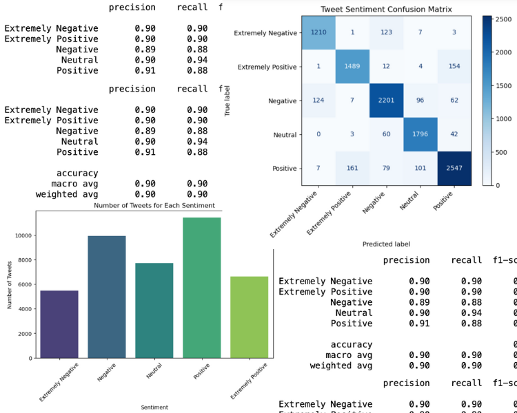
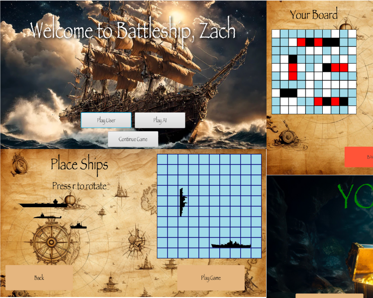
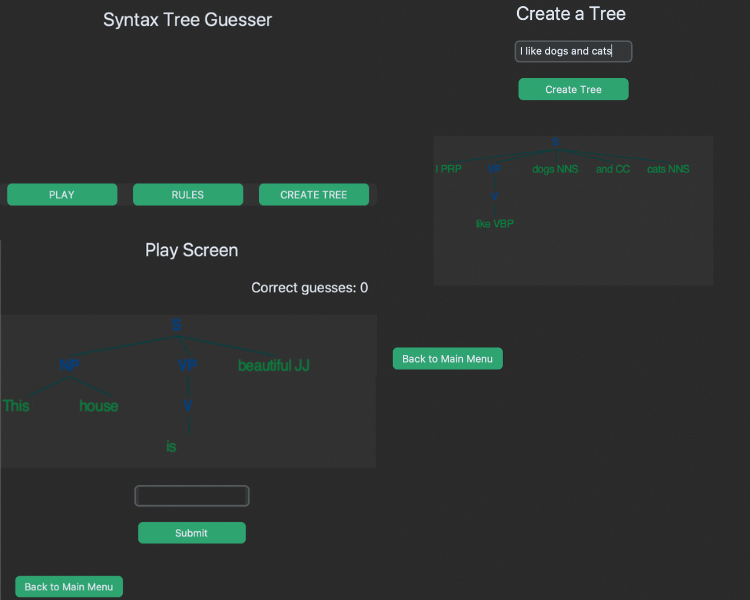
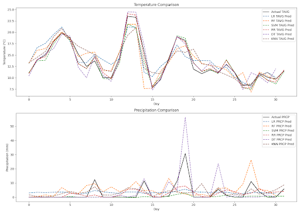

Portfolio

---

### Projects

### [Sentiment Analysis of Covid Tweets](Sentiment_analysis_covid-2/Sentiment_analysis_covid.md)

This project investigates the performance of Naive Bayes and SVM models on tweets made through-out the COVID-19 Pandemic, in order to make an accurate multi-class model to determine sentiment. 

---

### [JavaFX Battleship](https://drive.google.com/drive/folders/1vLBnGXGiOdrYrZfDDUy-KJZBk7zf_bwh?usp=sharing)

This project uses a client-server network to host a battleship game with a GUI powered by JavaFX. 

Here is a quick link to a [powerpoint showing some of the UI!](https://docs.google.com/presentation/d/1_1wRdiF9V4dvdhygeJr7y3Ek1-YMpN5-LiivXzHD_OA/edit#slide=id.p)

I worked on this project with Bryce Sadelski and Alec Yaagoub. 

---

### [Syntax Tree Generator](/Syntax_tree_generator.md)

Using a combination of python's CustomTkinter GUI and NLTK libraries, this application functions as a syntax tree generator and guessing game. 

### [Evaluating Accuracy of Current Weather Models with ML](https://github.com/JoseB29/412FinalProject)

Using various machine learning models (Linear Regression, Ridge Regression, Random Forest, SVM, and KNN), this project investigates the accuracy of current weather models and how accurately different machine learning models are at predecting weather. 

---

### Code Links

- [Sentiment Analysis of Covid Tweets](Sentiment_analysis_covid-2/Sentiment_analysis_covid.md)
- [JavaFX Battleship](https://drive.google.com/drive/folders/1vLBnGXGiOdrYrZfDDUy-KJZBk7zf_bwh?usp=sharing)
- [Syntax Tree Generator](/Syntax_tree_generator.md)
---
