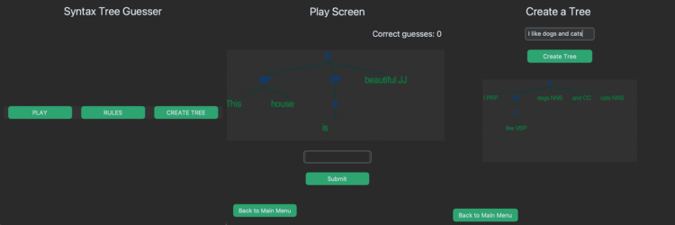

## Portfolio

---

### Projects

This is my [Syntax Tree Generator](/Syntax_tree_generator.md)

Python: NLTK, CustomTkinter

---
[Sentiment Analysis of Covid Tweets](/Sentiment_analysis_covid.md)

---
[Project 3 Title](http://example.com/)

---

### Code Links

- [Syntax Tree Generator](/Syntax_tree_generator.md)
- [Project 2 Title](http://example.com/)
- [Project 3 Title](http://example.com/)
- [Project 4 Title](http://example.com/)
- [Project 5 Title](http://example.com/)

---

---
