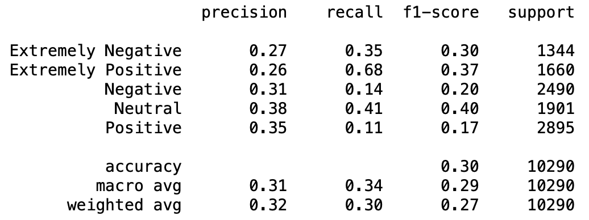

```python
import numpy as np
import pandas as pd
import matplotlib.pyplot as plt
import seaborn as sns
from sklearn.metrics import accuracy_score, classification_report, confusion_matrix
from sklearn.model_selection import train_test_split, cross_val_score, GridSearchCV
from sklearn.naive_bayes import GaussianNB
from sklearn.preprocessing import StandardScaler
from sklearn.feature_extraction.text import TfidfVectorizer
from sklearn import svm
from sklearn.svm import SVC
from sklearn.pipeline import make_pipeline
from sklearn import metrics
from scipy.sparse import hstack
from nltk.sentiment import SentimentIntensityAnalyzer
from nltk.corpus import stopwords
from nltk.stem import WordNetLemmatizer
import nltk

# Importing the dataset
dataset = pd.read_csv('Corona_NLP_train.csv', encoding='latin-1')

# Split the data into inputs and outputs
X = dataset.iloc[:, 4].values  # tweet
y = dataset.iloc[:, 5].values  # sentiment 

# Function to load GloVe vectors
def load_glove_vectors(file_path):
    glove_vectors = {}
    with open(file_path, 'r', encoding='utf-8') as f:
        for line in f:
            values = line.split()
            word = values[0]
            vector = np.array(values[1:], dtype='float32')
            glove_vectors[word] = vector
    return glove_vectors

# Load GloVe vectors (update the path to your downloaded file)
glove_vectors = load_glove_vectors('/Users/zachetzkorn/Downloads/glove/glove.6B.100d.txt')

# Training and testing data; assign test data size 25%
X_train, X_test, y_train, y_test = train_test_split(X, y, test_size=0.25, random_state=0)

# Preprocessing the text data for GloVe
def preprocess_text(text):
    return text.lower().split()  # Simple tokenization and lowering case

# Tokenizing the tweets
X_train_tokens = [preprocess_text(tweet) for tweet in X_train]
X_test_tokens = [preprocess_text(tweet) for tweet in X_test]

# Create a function to convert sentences to vectors using GloVe
def vectorize_sentences(tokens, glove_vectors):
    vector = np.zeros(100)  # Change to the dimension of your GloVe vectors
    count = 0
    for word in tokens:
        if word in glove_vectors:
            vector += glove_vectors[word]
            count += 1
    return vector / count if count > 0 else vector

# Vectorizing the training and testing data
X_train_vectors = np.array([vectorize_sentences(tokens, glove_vectors) for tokens in X_train_tokens])
X_test_vectors = np.array([vectorize_sentences(tokens, glove_vectors) for tokens in X_test_tokens])

# Scaling the input data
sc_X = StandardScaler()
X_train_scaled = sc_X.fit_transform(X_train_vectors)
X_test_scaled = sc_X.transform(X_test_vectors)

# Initialise Naive Bayes classifier
clsf = GaussianNB()

# Train the model on the training set
clsf.fit(X_train_scaled, y_train)

# Test the model on the test set
y_pred = clsf.predict(X_test_scaled)

# Model performance on the test set
print(classification_report(y_test, y_pred))
```

                        precision    recall  f1-score   support
    
    Extremely Negative       0.27      0.35      0.30      1344
    Extremely Positive       0.26      0.68      0.37      1660
              Negative       0.31      0.14      0.20      2490
               Neutral       0.38      0.41      0.40      1901
              Positive       0.35      0.11      0.17      2895
    
              accuracy                           0.30     10290
             macro avg       0.31      0.34      0.29     10290
          weighted avg       0.32      0.30      0.27     10290
    


<div style="display: flex; justify-content: space-between; align-items: center;">
    
    
</div>


```python

```
